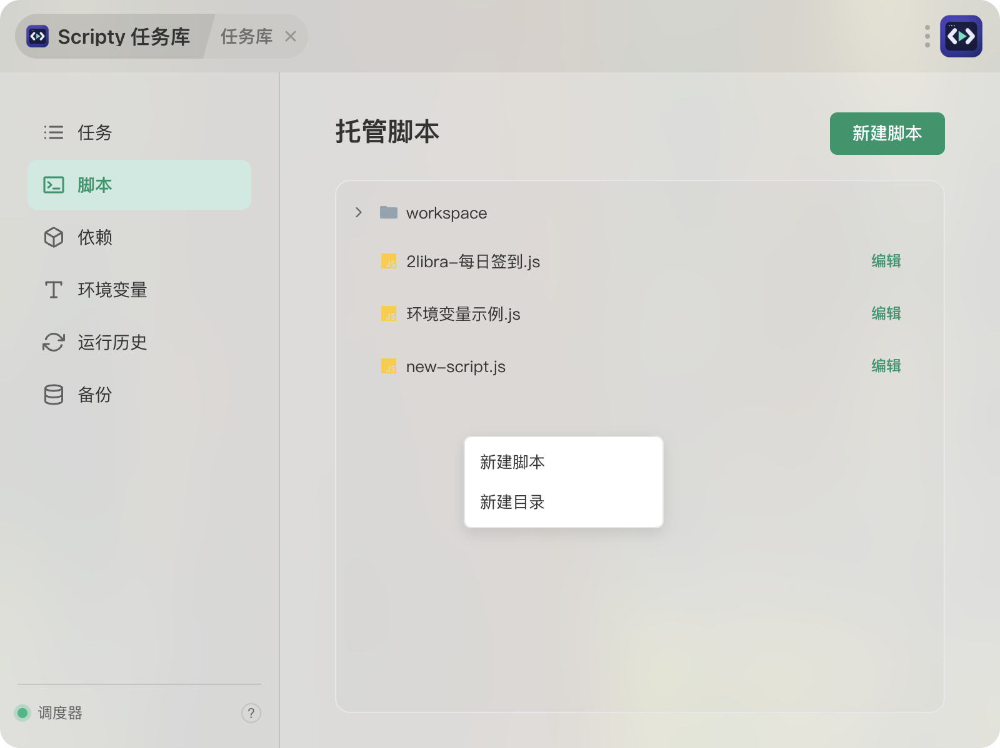
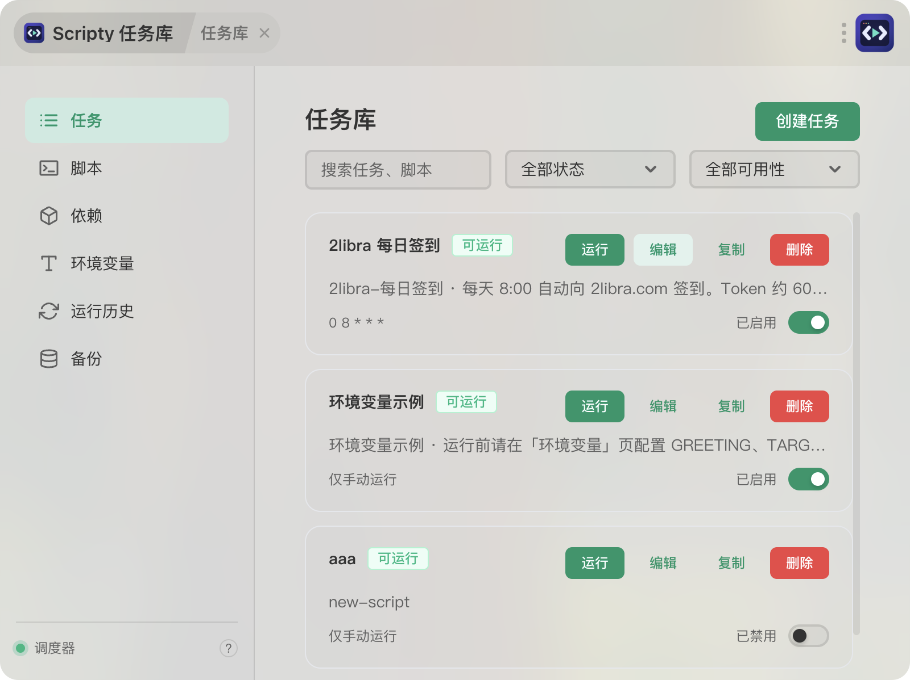

# Scripty

> ZTools 里的本地脚本任务管理器。

如果你本机攒了一堆脚本——抓数据的、清理文件的、定时跑的——东一个西一个，跑起来还得手动敲命令、翻终端找上次报了什么错，Scripty 就是来收拾这个摊子的。脚本源码、任务配置、环境变量、运行记录和日志全部存在本地 `<ZTools userData>/scripty`，不连任何远程服务。





## 能干嘛

挑重点说几件：

- **管脚本**：JavaScript、Python、PowerShell、Shell 都能托管，源码统一放在 Scripty 自己的目录树里，不用满硬盘找文件
- **跑任务**：把脚本关联成任务，配好参数、工作目录、超时和并发策略，想什么时候跑就什么时候跑
- **定时触发**：填个五段式 Cron 到点自动跑，还能预览接下来几次的触发时间，填错了不会瞎等
- **看输出**：stdout / stderr 实时刷屏，跑完去历史里翻退出码、耗时和分块日志
- **管环境变量**：全局的和任务级的都支持，敏感值默认遮罩，写日志前也会脱敏，不会偷偷漏进日志文件
- **依赖环境**：Node 的 `package.json` / `node_modules`、Python 的 `requirements.txt` / `.venv` 都在依赖页统一维护，不污染系统全局
- **备份迁移**：导出 ZIP，换机器导入时能预览要改哪些东西，合并还是覆盖自己选
- **给 AI 调**：Scripty 把脚本、任务和环境变量管理能力暴露成一组 MCP 工具（`list_scripts`、`create_task`、`list_environment_variables`、`update_environment_variable`、`delete_environment_variable`、`run_task`、`read_run_log`……），Claude Code 这类客户端连上 ZTools 就能直接操作——让 AI 帮你建脚本、配任务、维护环境变量、跑完看日志都行。环境变量的 MCP 读取严格只返回名称；更新时可以提交新值用于本地写入，但已有值和写入值都不会出现在工具响应里

## 上手流程

1. ZTools 里喊「任务库」或「Scripty」打开插件
2. 在「脚本」里建个脚本，写代码
3. 用了第三方包就去「依赖」页加一下，同步共享环境
4. 到「任务」里把脚本关联成任务，配上参数和（可选的）Cron
5. 手动跑一下试试，或者打开 Cron 让它自己跑
6. 「运行中」看实时输出，「运行历史」翻结果和日志
7. 换机器前在「备份」里导个包带走

顺带一提：任务参数是按数组传给 `child_process.spawn` 的，默认 `shell: false`，不会把任务名和参数拼成一条 Shell 命令——少了一层被注入的风险，该自己转义的参数还是得转义。

## 几件得先知道的事

### Cron 只在插件活着的时候管用

Scripty 不是系统级守护进程。插件开着，调度正常跑；把窗口挂到后台、最小化都不影响；但完全退出插件或 ZTools 之后，调度就停了。它不承诺关掉之后还能后台执行，真要常驻请用系统的 cron / 计划任务。

### 数据和敏感信息

- 全部数据默认落在 `<ZTools userData>/scripty`
- 环境变量值存在本地文件里，不是系统密钥库，别拿它当保险柜用
- 敏感值默认不显示、不进普通导出，写日志前会遮罩
- 备份包默认不含敏感值；除非你显式勾选并二次确认，那个 ZIP 里才是明文敏感信息，请自己保管好
- 所有脚本源码都保存在 Scripty 托管目录里

目录长这样：

```text
<ZTools userData>/scripty/
├── data/              # 脚本、目录、依赖、任务、环境变量、设置、运行记录元数据
├── scripts/           # 应用托管的真实脚本目录树
├── package.json       # Scripty 生成的 Node 直接依赖清单
├── node_modules/      # 所有脚本共享的应用本地 Node 依赖
├── requirements.txt   # Scripty 生成的 Python 直接依赖清单
├── .venv/             # 所有 Python 脚本共享的虚拟环境
├── logs/              # 独立运行日志
└── backups/           # 覆盖恢复前的自动备份
```

### 解释器要自己装好

Scripty 不管装 Node.js、Python、PowerShell 或 Shell 运行时，本机得先有。找解释器的顺序：先看 ZTools 宿主进程的 `PATH`，再用登录 Shell 补（Windows 上走 `where.exe`），所以 nvm、pyenv、mise 这些版本管理器装的基本都能识别。

macOS 上如果图形界面的 `PATH` 里没 Node，还会去 `$MISE_DATA_DIR`、`XDG_DATA_HOME/mise`、`~/.local/share/mise` 下面找标准 Node 安装。mise 优先认 `installs/node/latest/bin/node`，没有就回退到 `shims/node`。解析出来的路径只缓存在当前插件进程里，不写进任务或备份。要是提示找不到，先在登录终端里 `node -v` 确认一下能不能直接调起来。

Node 和 Python 的直接依赖在独立的「依赖」页维护，统一装到 `<userData>/scripty/node_modules` 和 `<userData>/scripty/.venv`，脚本运行不依赖系统全局的第三方包。

### 不打算做这些（省得期望落空）

- 多设备同步、用户系统、远程访问
- Docker、分布式执行节点、系统级守护进程
- Git 仓库订阅、远程脚本自动更新、在线脚本市场
- 运行时自动安装
- 青龙面板 API 兼容

平台方面，MVP 优先保证 Windows 能用，执行层本身按可扩展到 macOS 和 Linux 的思路设计。

## 开发

需要 Node.js 18+、npm，跑宿主集成验证还得有 ZTools。

```bash
npm ci
npm run dev          # 开发地址 http://localhost:5177
```

构建走类型检查、Vite 生产构建和 preload 依赖打包，最终产物在 `dist/`，可以直接整体导入 ZTools：

```bash
npm run build
```

`build` 会把 `cron-parser`、压缩包处理等 preload 依赖内嵌到 `dist/preload/services.js`，不会在插件中保留 `node_modules` 或未打包的 preload 源文件。可以额外运行构建校验：

```bash
npm run build:verify
```

## 项目结构

```text
.
├── public/
│   ├── logo.png
│   ├── plugin.json
│   └── preload/        # 文件、进程、调度、历史、环境、备份服务
├── src/
│   ├── components/     # 任务、脚本、历史、环境、依赖、备份视图
│   ├── types/          # 领域模型与受限 preload API 类型
│   ├── App.vue
│   ├── main.ts
│   └── plugin-entry.ts
├── RELEASE_NOTES.md
├── ROADMAP.md
└── package.json
```

